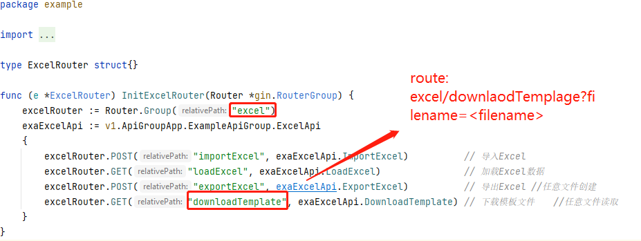

# Directory Traversal in gin-vue-admin
English | [Chinese](diretory_traversal_downloadTemplate_cn.md)  

## Summarize
* affected version <= v2.5.0b  
* related file: `github.com/flipped-aurora/gin-vue-admin/server/api/v1/example/exa_excel.go`  
* related router: `excel/downloadTemplate?filename=<DirectoryTraversal>`  

## Vulnerability Analysis
The handler function to this vulnerable router is `DownloadTemplage` in file `exa_excel.go`,here is the source code:
  
The parameter `feleName` is taken directly from the request without any filtering and concatenated to the filePath parameter.So we could use `../` to read any files we want.

## Vulnerability Recurrence
here is a example.Let's read file `config.yaml` through this vulnerability.
