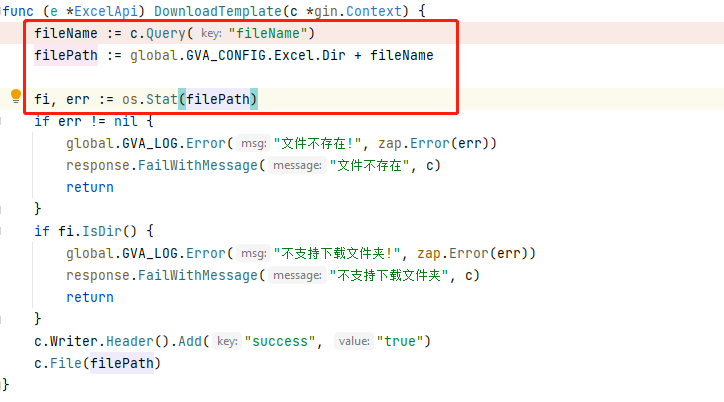
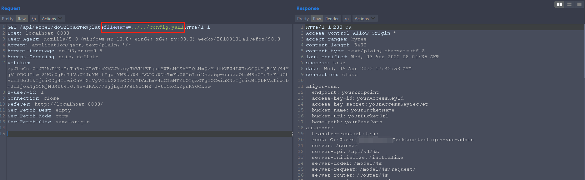

# gin-vue-admin目录遍历/任意文件读取
[English](diretory_traversal_downloadTemplate.md) | Chinese

## 漏洞说明
* 影响版本 <= v2.5.0b  
* 涉及文件 `github.com/flipped-aurora/gin-vue-admin/server/api/v1/example/exa_excel.go`  
* 涉及路由 `excel/downloadTemplate?filename=<路径穿越>`  

## 漏洞分析
该路由对应的handler是exa_excel.go的DownloadTemplage函数。看下源码如下

filename参数直接从请求中获取，并拼接到filePath参数，最终读取的文件就是filePath的值,并未做任何过滤.

## 漏洞利用
已读取config.yaml配置文件为例，构造如下请求

